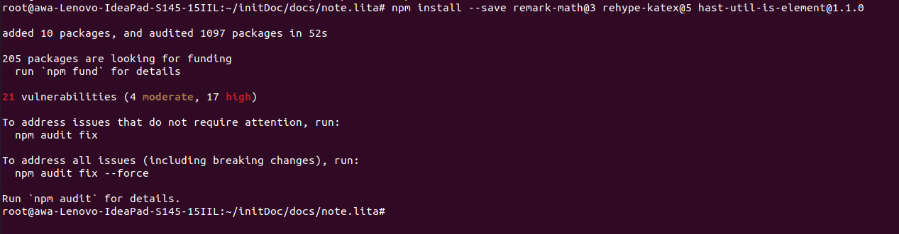
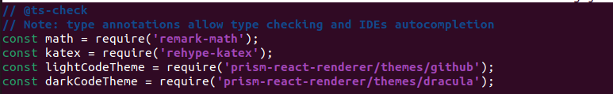
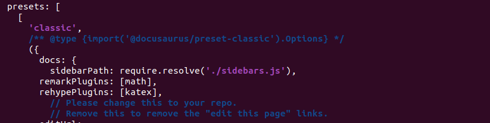
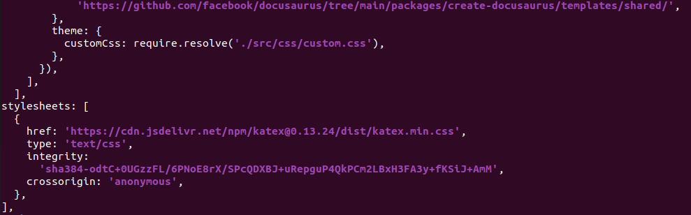
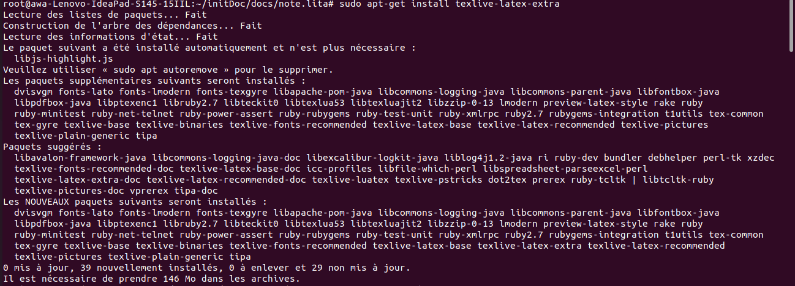
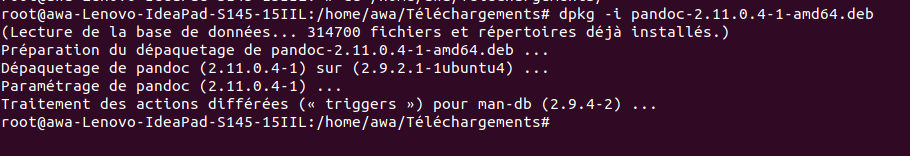
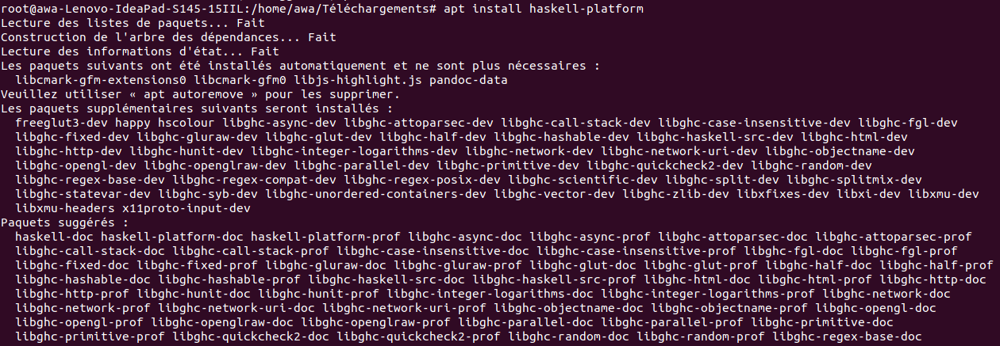
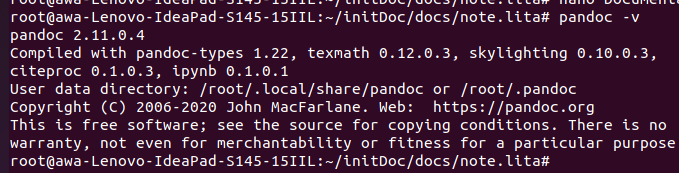

# RÉPUBLIQUE DU SÉNÉGAL

   

# UNIVERSITE CHEIKH ANTA DIOP DE DAKAR

   

# ECOLE SUPERIEURE POLYTECHNIQUE
 
  *DEPARTEMENT GENIE INFORMATIQUE*

 
   

###  MEMOIRE DE FIN DE CYCLE
 
   Pour l’obtention du
 
    DIPLÔME TECHNICIEN SUPERIEUR  EN TELECOMMUNICATIONS ET RESEAUX

  

*SUJET* :

      Mise en place d'une plateforme de collaboration pour  les  chercheurs du 
     labo LITA de l'UCAD

 

*Lieu du stage* :** Laboratoire d'Informatique, Télécommunications et Applications (L.I.T.A.)**

*Période* : *01/06/2022 – 15/07/2022*

Présenté et soutenu par :

**AWA LO**

**AARON JUNIOR CHIENNE**

Professeur encadrant:

**PR SAMUEL OUYA**

     Année universitaire : 2021 – 2022

### Dédicaces

ALKHAMDOULILLAH, nous rendons grâce à ALLAH, Le Tout Miséricordieux, Le Très
Miséricordieux.
Nous dédions ce mémoire à :

• A nos très chers parents, aucune dédicace ne saurait exprimer l’amour, l’estime et le
respect que nous avons à votre égard. Ce travail est le fruit des nombreux efforts que vous
avez consentis pour notre éducation ;

• Nos frères et sœurs ;

• Nos familles : oncles, tantes, cousines et cousins ;

• Nos amis, , camarades de promotions ;

• Tout le département Génie Informatique ;

• Nos collègues ;

• Les étudiants de la promotion

### Remerciements

ALLAH SWT ;

• Notre professeur encadrant, le Pr Samuel OUYA pour sa disponibilité, ses conseils et
son assistance ;

• L’ensemble des professeurs du département Génie Informatique ;

• L’ensemble du personnel de la structure d’accueil du stage, L.I.T.A. du département
Génie Informatique (Laboratoire d’Informatique, Télécommunications et Applications) ;

• Toutes les personnes qui de près ou de loin, ont contribué à la réalisation de ce
document.

### Résumé

Ce document présente le rapport de notre stage effectué au sein du **Laboratoire
d’Informatique, Télécommunications et Applications (L.I.T.A.)**  du département Génie
Informatique de l’École Supérieure Polytechnique de Dakar et s’insère dans le cadre d’un stage
de fin de cycle pour l’obtention du **Diplôme Technicien Supérieur (DST) en
Télécommunications et Réseaux**. Notre travail est intitulé :

  **Mise en place d'une plateforme de collaboration pour  les  chercheurs du labo LITA de l'UCAD**

### Table des matières

DÉDICACES ...............................................................................................I 

REMERCIEMENTS ..........................................................................................II

RÉSUMÉ ...............................................................................................III

INTRODUCTION ...................................................................................1

CHAPITRE 1 : PRESENTATION GENERALE ......................................................................... 

1.1.PRÉSENTATION DE LA STRUCTURE D’ACCUEIL ....................................................................... 

1.2.PRÉSENTATION DU SUJET.......................................................................................... 

1.2.1. Contexte du sujet .....................................................................................

1.2.2. Problématique........................................................................................

1.2.3. Résultats attendus ......................................................................................

CHAPITRE 2 : ETUDE  DES OUTILS  DU SITE  .................................................................

 

2.1.Présentation de  Katex.................................................................

   2.1.1. Installation katex............................................... 
 
   2.1.2. Utilisation  Katex................................................

2.2.Présentation de  Latex.......................................................................

   2.2.1. Installation latex ....................................................

   2.2.2. Utilisation latex ......................................................

2.4.Présentation de Pandoc.....................................................................
 
  2.3.1. Installation pandoc ............................................................
 
  2.3.2. Utilisation  pandoc ................................................................

2.4.Présentation de  Git.........................................................................................

   2.4.1. Installation git .......................................................
 
   2.4.2. Utilisation git ...............................................................

2.5.Présentation de GitHub
 
   2.5.1. Installation github .......................................................
 
   2.5.2. Utilisation github...............................................................

2.6.Présentation de Netlify

   2.6.1. Installation netlify .......................................................
 
   2.6.2. Utilisation netlify...............................................................

CHAPITRE 3 :ETUDE DÉTAILLÉ DE DOCUSAURUS.....................................................................

3.1. Qu'est ce que Docusaurus.....................................................................

3.2. Fonctionnalité..............................................................

3.4. Avantage...............................................................

3.3. Contrainte.............................................................

3.4. Installation........................................................ 

CHAPITRE 4 :MISE EN OEUVRE DU SITE .....................................................................
	
4.1. Création du site .............................................................

4.2. Création d'un document..................................................
 
4.3. Création d'un article de blog .............................................

4.4. Fonctionnalité de démarquage ............................................

4.5.  Déploiement du site...................................................... 

CONCLUSION................................................................

RÉFÉRENCES................................................................

### Liste des figures

figure1:

figure2:

figure3:

figure4:

figure5:

figure5:

figure6:

figure7:

figure8:

figure9:

figure10:

###  INTRODUCTION

Une plateforme de travail colloboratif est un espace de travail virtuel. c'est un outil parfois sous la 
forme d'un site internet qui centralise tous les outils liés à la conduite d'un projet ,la gestion des 
connaissances et le met à la disposition des acteurs.Son but est de faciliter optimiser la communication entre 
les individus dans le cadre travail ou d'une autre quelconque tâche.

Notre projet au sein du  Laboratoire d’Informatique,Télécommunications et Applications (L.I.T.A.) du département 
Génie Informatique qui est une structure de recherche, d’études et de travaux sur l’informatique les télécommunications 
et les systèmes et matériels informatiques. consiste à déployer un site tel que *Docusaurus* qui est un générateur de site 
statique .Il construit une application monopage avec une naviguation rapide côté client en exploitant toute la puissance pour 
rendre le site interactif .Ceci pourra permettre aux chercheurs du labo de coopérer pour mettre en leur idées dans l'objet de
 résoudre une problématique .

Le présent mémoire  est organisé comme suit :

Le premier chapitre intitulé « Présentation Générale » sera consacré à la présentation du structure  d’accueil, ainsi que la 
mise en contexte du projet.Nous présenterons l’étude de l’existant qui consiste à décrire le fonctionnement de la plateforme .

Par ailleurs, un second chapitre rendra compte de la «Présentation des outils»,
 Ce chapitre proposera  la description détaillée des outils utilisés ainsi que leur installation.

De surcroît, un troisième chapitre sera entièrement dédié à « l'étude détaillé du site Docusaurus » . Cela
dit, il sera question d'apporter des explications nécessaires sur  l’architecture du système et le matériel de déploiement du site 
.Le tout accompagné des scénarios et descriptions nécessaires.

Le quatrième et le dernier chapitre sera voué à «la mise en oeuvre du site »qui aura pour objectif d’expliquer tout le processus 
de mise en place du site ainsi que son utilisation . 

Enfin, notre rapport se terminera par une conclusion générale résumant notre travail,
présentant les acquis techniques et personnels et proposant quelques perspectives pour
l’amélioration de notre plateforme.

###   CHAPITRE 1 : PRÉSENTATION GÉNÉRALE

###  Introduction

Le premier chapitre sera dédié pour la présentation générale du projet. Tout d’abord, nous
allons présenter la structure  d’accueil. Ensuite, nous allons décrire brièvement le sujet, la
problématique à résoudre, ainsi faire une étude des résultats attendus .

### 1.1.Présentation de la structure d'acceuil

### 1.2.Présentation du sujet 

Le projet s’intitule «**Mise en place d'une plateforme de collaboration pour  les  chercheurs du labo LITA de l'UCAD**».Il s'agira de mettre
en oeuvre une plateforme  de communication et de  documentation pour les chercheurs enfin de faciliter leur colloboration.

**1.2.1. Contexte du sujet** 

Notre projet vise à mettre en place une nouvelle plateforme de colloboration pour les chercheurs  du Laboratoire d’Informatique, 
Télécommunications et Applications (L.I.T.A.) . 

Notre réflexion vis à vis du sujet c'est porté sur le déploiment de Docusaurus.Il s’agit d’un espace de travail virtuel, un site,
 permettant l’accès à de nombreuses fonctionnalités tel que  permettre par exemple aux utilisateurs de se connecter à une base de données, 
d’échanger des données, ou bien encore de synchroniser des fichiers entre plusieurs programmes informatiques via une extension, un plugin,
 ou une API (application programming interface / interface de programmation).

IL permet également aux membre du labo d' interagir pour accomplir l’objectif fixé, chacune selon ses compétences et le rôle qu’elle joue 
dans la dynamique de groupe.

**1.2.2. Problématique**

La possibilités de communiquer en temps réel pause énormemment de problémes aux cheurcheurs.Les informations sont souvent transmis par 
mails mais par faute de temps et même d'inattention ils oublient de lire le message.C’est pour cela qu’il nous faudrait un système où l’on
puisse retrouver toutes les informations du labo et qui puisse également permettre  aux chercheurs d'échanger entre eux.

Un système simple, efficace et qu’on a pas besoin d’ouvrir tous les jours mais qui envoit une notification lorsqu'on a du nouveaux .Un
systéme où les chercheurs pourraient  travailler à plusieurs simultanément, se concerter, s’interroger.

**1.2.3. Résultats attendus**

Dans l’optique de répondre aux besoins soulevés dans notre problématique, notre objectif principale sera la Mise en place d'une plateforme 
de collaboration pour  les  chercheurs du labo LITA.L' objectif sera de mettre un outil et de la documentation permettant  aux chercheurs 
de publier les  résultats de leur recherche.La plateforme doit permettre aux chercheurs d'avoir des versions de leur site dans plusieurs 
langues (fr, en, es). 

Le site  permettra aussi :
-   Création des fichiers .md et leur positionnement les uns par aux autres.
-   Intégration des images dans un fichier .md
-  Intégration des fichiers  .docs 
-  Intégration des fichiers pdf
-  Installation des plugins   pour des fonctionnalités supplémentaires.
-  Integration de   formules mathématiques
-  Intégration de moteur de recherche sur son site
-  Référencement de son site web
-  Intégration et prise en main du module de traduction de son site dans des langues tels que fr en et es.

 
### CHAPITRE 2 :ETUDE DES OUTILS   DU SITE 

### 2.1.Présentation de Katex

KaTeX est une bibliothèque JavaScript multi-navigateur qui affiche la notation mathématique dans les navigateurs Web. Il met l'accent 
sur le fait d'être rapide et facile à utiliser. Il a été initialement développé par Khan Academy, et est devenu l'un des cinq meilleurs 
projets sur GitHub en septembre.

**2.1.1. Installation katex**

 voici le lien de documentation  de Katex   https://katex.org/ 

on tape d'abord la commande: npm install --save remark-math@3 rehype-katex@5 hast-util-is-element@1.1.0

   

*figure1*:

Importons les plugins dans **docusaurus.config.js**

*figure2*:

Ajoutons-les aux options de votre plugin de contenu ou de votre preset (généralement les options de docs de @docusaurus/preset-classic) :

*figure3*:

inclure le CSS de KaTeX dans votre configuration sous stylesheets :

*figure4*:

**2.1.2. Utilisation Katex**
 katex est outil qui permet l'intégration des équation dans le site .

*Illustrons un exemple:* 

$$
I = \int_0^{2\pi} \sin(x)\,dx
$$

 
### 2.2.Présentation de Latex 

LaTeX est un langage et un système de composition de documents. Il s'agit d'une collection de macro-commandes destinées à faciliter
 l'utilisation du « processeur de texte » TeX de Donald Knuth.

**2.2.1. Installation latex**

[voici le guide de latex](./guide-latex-fr.pdf)

utilision la version texlive pour installer latex ,de ce fait tapons la commande suivante apt install texlive-latex-extra

*figure5:*

**2.2.2. Utilisation latex**

LaTeX permet à l'utilisateur de se concentrer sur le contenu du document sans se soucier de la mise en forme qui sera effectuée 
automatiquement. Par exemple, on change de taille de caractères relativement à une taille par défaut qui est précisée au début du document.

*Illustrons un exemple:*

**Fundamental Theorem of Calculus**
Let $f:[a,b] \to \R$ be Riemann integrable. Let $F:[a,b]\to\R$ be $F(x)=
\int_{a}^{x}f(t)dt$.
Then $$F$$ is continuous, and at all $x$ such that $f$ is continuous at $x$,
$F$ is differentiable at $x$ with $F'(x)=f(x)$.

### 2.4.Présentation de Pandoc

Pandoc est un logiciel libre de conversion de documents numériques en ligne de commande développé par John MacFarlane en Haskell et 
publié sous licence GPL.

**2.3.1. Installation pandoc**
 voici le lien d'installation de pandoc https://www.google.com/url?sa=t&rct=j&q=&esrc=s&source=web&cd=&cad=rja&uact=8&ved
=2ahUKEwjQ4aK-odj4AhVuSfEDHX0UB_gQFnoECAkQAQ&url=https%3A%2F%2Fgithub.com%2Fjgm%2Fpandoc%2Freleases&usg=AOvVaw1TTFB26QWXPM3ajprf8jBS

Pour installer pandoc essayons de faire 

*figure6:*

*figure7:*

*figure8:*

**2.3.2. Utilisation pandoc** 

Vous pouvez utiliser pandoc sur Linux pour convertir entre plus de 40 formats de fichiers. Vous pouvez également l'utiliser pour créer 
un système docs-as-code simple en écrivant dans Markdown, en stockant dans git et la publication dans l'un de ses formats pris en charge.

Illustrons un exemple:

### 2.4.Présentation de Git

Git est un logiciel de gestion de versions décentralisé. C'est un logiciel libre créé par Linus Torvalds, auteur du noyau Linux, et 
distribué selon les termes de la licence publique générale GNU version 2. Le principal contributeur actuel de Git, et ce depuis plus 
de 16 ans, est Junio C Hamano.

**2.4.1. Installation git**

**2.4.2. Utilisation git**

GIT utilise un modèle de données qui aide à garantir l'intégrité cryptographique de tout ce qui est présent dans un dépôt. Chaque fois 
qu'un fichier est ajouté ou qu'une validation est effectuée, des sums de contrôle sont générés. Aussi, ils sont récupérés via leurs sums 
de contrôle.

### 2.5.Présentation de GitHub

GitHub est une plate-forme d'hébergement de code pour le contrôle de version et la collaboration.  Il vous permet, à vous et à d'autres,
 de travailler ensemble sur des projets où que vous soyez.

**2.5.1. Installation github**

**2.5.2. Utilisation github**

### 2.6.Présentation de Netlify

Netlify est une plate-forme d'hébergement Web et d'automatisation qui accélère la productivité du développement.  En unifiant 
les éléments Web découplés modernes des processus de développement locaux aux logiques avancées, Netlify offre un moyen incroyablement 
plus rapide de garantir des sites Web et des applications beaucoup plus performants, évolutifs et sécurisés.

**2.6.1. Installation netlify**

**2.6.2. Utilisation netlify**
